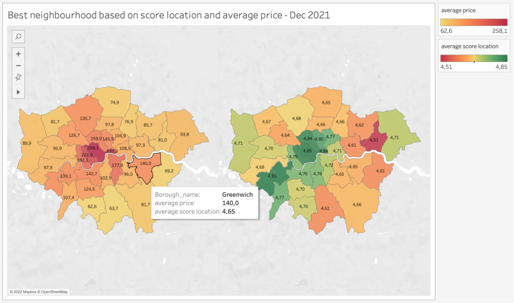
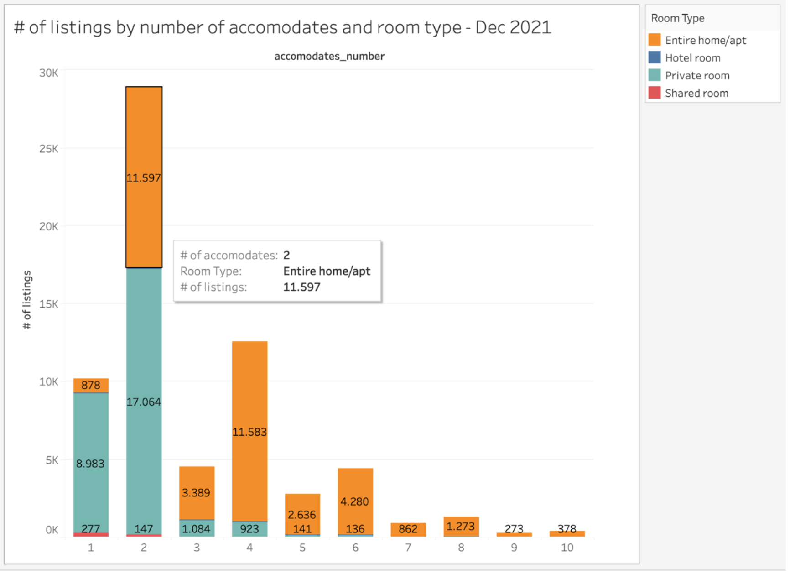
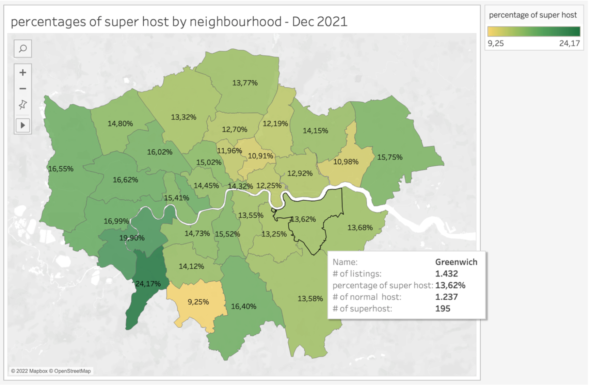
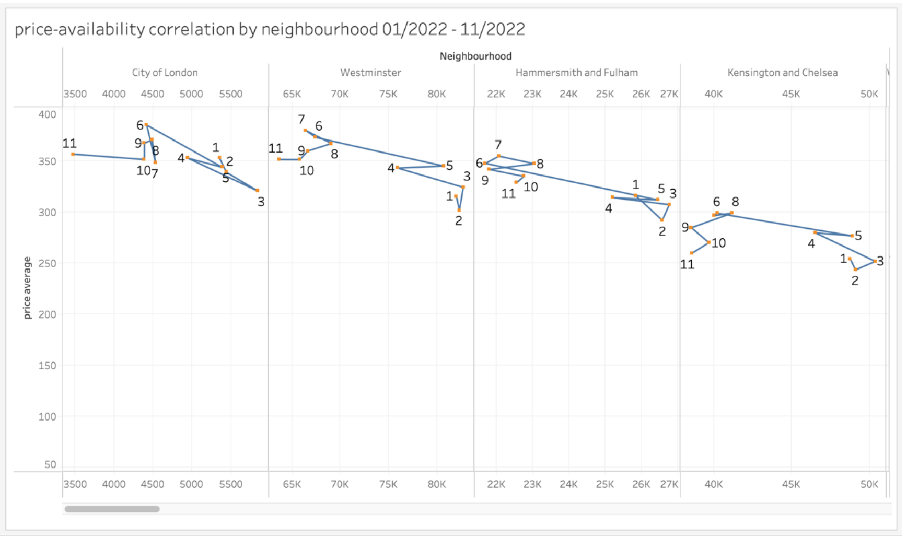
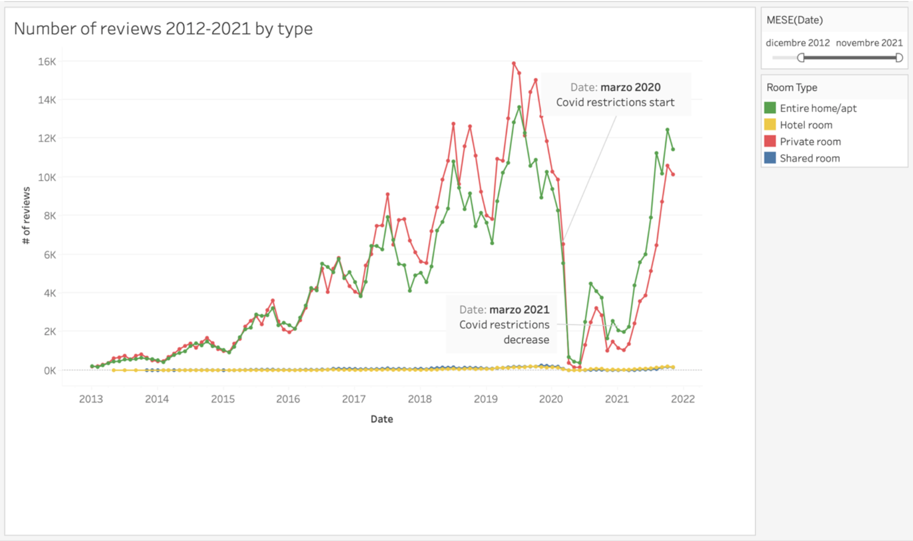

# London Airbnb: Data Visualization using Tableau

## Introduction

The project we worked on is based on data relating to the AirBnb service, a portal that connects people looking for accommodation in a specific city for short periods of time, with other people who have accommodation to rent. We will specifically focus on the AirBnb service in the city of London, United Kingdom, a very visited place internationally, for vacation, work commitments and commitments due to study or university.
The following project aims to analyze this service, through visualizations, to identify the best neighborhoods to stay in the city of London taking into account various factors including: the time of year, the price, user ratings, the type of apartment and the number of guests, thus making it possible to understand many of the characteristics that make up the AirBnb service. Furthermore, the consequences of using the service caused by the restrictions given by the Covid-19 pandemic are analysed, highlighting the changes that have taken place.

## Dataset 
The data used concern all the listings on the Airbnb site from September 2021 to December 2021, and come from publicly available information on the site. Specifically, all the ads present, the reviews of these ads and the calendar relating to future availability until December 2022 were scraped.
The dataset can be downloaded from the link (*http://insideairbnb.com/get-the-data.html) via a collection of three Csv files, which respectively include the listings, the reviews and the calendar.
The tool used to produce the visualizations is Tableau.

## Main features selection
Each file in .csv format contained in the collection represents a relational database table, with the related primary keys, foreign keys and association relationships.
There are 74 different attributes in the original dataset, most of which are unnecessary and not significant for the purpose of this case study, and which would make processing the file computationally expensive. A selection process of the significant attributes was therefore carried out, creating three new files in .csv format which contained only the fields strictly necessary for the purpose of the various visualisations.

## Data Understanding
Below are the tables, in Figure 1, deriving from the files after having carried out the selection process, with a detailed description of all the selected fields. Each of these tables represents an entity within the relational type diagram.

## Data Preprocessing
The data obtained is presented in several files representing the different entities. Some of the different fields were not suitable for carrying out the various analyzes and visualizations, therefore a cleaning process was carried out for the two "price" fields present in the Listings and Calendar tables, eliminating the "$" character, which made it a string type field within Tableau software.

## Join operations
The Join operation was performed between the two tables Listings and Reviews in such a way as to obtain a single table on which it was possible to build the views. Through this operation, visible in figure 3, the listings_summary file was connected, which contains all the information on the ads, to the reviews_summary file, which includes all the reviews received for each ad present, via the "listing_id" external key.
Subsequently, a dataset was downloaded containing the various spatial data of the shapefile type relating to the districts of London, in such a way as to be able to obtain a complete visualization of a geographical map on which a clear division of the city by districts is visible. The table containing the shapefile spatial data has been joined to the current table through a further Join operation using the various neighborhood names as a foreign key.

The table obtained is composed of 35 fields and 1,061,563 rows.
Given the large number of records in the table, in order to be able to view the "calendar_summary" table, it was decided to carry out a further join operation (figure 4) between the "calendar_summary" and "listings_summary" files as making a single table for the three entities would have generated too large a file. This table obtained is composed of 29 fields and 24,322,727 rows.

# Charts
## 1. Does a higher average price ensure a high score on location reviews?

The visualization chosen is a spatial graph (figure 5) which represents two geographical maps of the city, respectively a map which indicates the variation of the average price within each district and one which represents the average evaluation given by users in each district regarding the accommodation location. This representation has the objective of immediately comparing the relationship between the average price and the score on the location of the accommodation, so as to identify which neighborhoods have the best quality/price ratio. The location score is a rating that indicates the safety, features of points of interest, stations, and transportation points. To indicate the variation of the average ratings, a colormap was chosen that allowed the worst ratings to be indicated in red, the average ones in yellow and the best ones in green.

The graph shows how the central areas of the city, in particular the Westminster district (with the greatest number of points of interest) are the ones with the highest rental costs. However, it is evident that, in relation to its high prices, it is one of the districts with the highest location score, which indicates a relationship between a higher price and a higher quality regarding the accommodation area. Taking into consideration the more peripheral districts, we note a drop in average prices but also a drop in evaluation scores, which indicate the lower presence of stations and points of interest. In the west of the city there are neighborhoods with a lower average rental cost while maintaining a high rating. A neighborhood that does not respect this correlation is Brent, which has a high average cost similar to central areas but a lower location score than other neighborhoods with similar prices.

## 2. What types of accommodations are most frequently advertised based on the number of guests?
For this view, a stacked bar graph was chosen in figure 6 in order to show the total number of accommodation listings offered on the Airbnb site based on the number of guests. For each type of accommodation, distinguishable and identifiable colors have been chosen through the legend present. Furthermore, the values representing the total number of ads for each type and number of guests are shown on the screen, in order to be able to immediately identify the differences in the number of ads present by varying the number of guests taken into consideration, information that cannot be perceived precisely by graphic. If there were problems in distinguishing colors by a user, by moving the cursor towards one of the bars present in the visualization, it is possible to bring up a box containing all the information such as the number of guests, the type of accommodation and their number of announcements available on the site. The title shows the instant in time taken into consideration for display, December 2021.

In the visualization carried out it is immediately visible that for a single guest most of the ads offered concern the "private room" type, which suggests that this is the most used solution in this case, while the "entire home/apt" solution is very infrequent in this case. In the case of two guests, a much greater distribution of the entire apartments is immediately noticeable, although it is still more frequent to find announcements about private rooms. Furthermore, it is evident from the visualization that the number of guests equal to two is the solution most present in Airbnb ads in the city of London.
From a number of guests greater than or equal to 3, a greater presence of entire apartments rather than private rooms is visible. However for 3 guests something unusual happens, as there is a sharp decrease in the number of ads available for this solution.
Finally, it should be noted that the "shared room" type is minimally present for one or two guests, but disappears in all other cases, while the "hotel room" type is not visible as, although it is possible for a hotel to rely on the Airbnb, it is not very present in the ads, which makes it not significant for the analysis.

## 3. Which neighborhoods have the highest percentage of super hosts?
A spatial visualization (figure 7) of the city of London was chosen to be able to intuitively represent the distribution of super hosts within each district, in order to be able to understand which areas have a greater number of super hosts. Distribution was represented by the percentage ratio between the total number of listings in a neighborhood and the number of listings managed by superhosts.
Each district is represented by a color that is part of the selected colormap, yellow-green, together with labels shown on the screen indicating the percentage value in order to have a more precise vision and be able to make more reliable comparisons.
Superhost is a label that is assigned to the best hosts on the platform, after they have met some requirements, and is therefore a guarantee for a guest to stay in the best possible accommodations.

The visualization shows how the central area of the city, i.e. the most expensive, actually has a lower distribution of superhosts in proportion to the total number of ads, which demonstrates how owning more expensive accommodation in central areas makes it more difficult to become a superhost, satisfying the requirements imposed by Airbnb. One of the best areas of the city where there is a greater presence of superhosts proves to be the area to the west, which turns out to be an area with a higher probability of staying in excellent apartments. While the highest percentage is 24% and there is one neighborhood just over 9%, most neighborhoods have about 14-15% of superhost-managed listings of their total listings.

## 4. Does the average price of housing vary in relation to their availability in the various districts during the year 2022?

In order to represent the existence of a correlation between the trend of the average price and the trend of availability during the year 2022 within each district, a connected scatterplot table was chosen (figure 8), which would allow to represent any seasonality present in an intuitive way. Although there is no direct time reference, the time has been reported in the graph through each node representing a month of the year 2022. The sum of the days available for each advert is indicated on the abscissa axis for each district, while the average price is shown on the y-axis.
It is therefore possible to note the evolution of the relationship between the two attributes taken into consideration over time. Each point is interconnected to the others through two connections, except the start and end point. The districts have been sorted by their average price value and it has been chosen to represent all the districts in order to have a direct comparison and to have a better and more precise idea of the phenomenon.

Observing this visualization it is possible to notice, for each neighborhood with the highest average price, the presence of two main patterns that represent the periods ranging from January to May and from June to November, respectively. The first pattern that includes the months January-May shows a constant behavior, as it maintains approximately the same price and the same availability during this period. After this period, specifically in the month of June, there is an increase in the price and a decrease in availability in the districts with the highest average price, which is interpreted with the arrival of the tourist season and a greater demand for the service. The period from June to November is represented by the second pattern which shows a further constancy of the phenomenon described above, with a slight drop in the price in the months of October-November. The period of June-July turns out to be the one with the highest price.

## 5. How has the number of user reviews changed over the years 2012-2021 by type of accommodation?

The visualization produced is a line chart (figure 9) which contains four lines that indicate the trend in the number of reviews over the years examined. A line chart was specifically chosen to be able to emphasize each trend that varies over time in a simple and intuitive way. On the abscissa axis there is the selected time interval 2012-2022; on the ordinate axis there is the count of unique reviews. Each point of the line chart represents a specific month of the year: this granularity was chosen in order to better represent and understand the seasonality during each year under consideration. The possibility of modifying the time period according to the analysis being carried out has also been added within the legend, having the possibility of going into more detail by selecting restricted time frames.

Through this visualization it is possible to notice a constant growth in the number of unique reviews, starting from the initial period of the Airbnb service until the end of the year 2019. Subsequently, a very strong drop in the number of reviews can be noticed starting from the month of March 2020, caused by the restrictive measures implemented in the UK during the Covid-19 pandemic. During the period of May 2020 we note a count of reviews equivalent to the year 2012, with an almost zero number of reviews. During 2020 and the beginning of 2021, due to the frequent restrictive measures implemented by the British government, the number of reviews carried out and therefore the demand for accommodation remained comparable to the year 2015, rising markedly during the summer of 2021 and returning almost to the levels of previous years, a result given above all by the greater flexibility of the anti-covid measures.
With regard to the variation of typologies, the graph shows a similar trend for the "entire home/apt" and "private room" typologies which represent almost all of the reviews. It can be noted that up to March 2020, the month in which the Covid restrictive measures, the "private room" type proves to be the most reviewed type over time. However, after the pandemic, it is clear from the visualization that the type with the most reviews has become "entire home/apt", suggesting a slight shift towards most commonly used type of accommodation.

# Conclusion
From the various analyzes conducted on the performance of the Airbnb service and the identification of the best areas in relation to various factors, it can be seen that there are some better areas that offer a greater probability of meeting excellent hosts and accommodations. In particular, it was found that there are areas with high assessments regarding the location and a price that is not comparable to the central areas. However, from the analysis it is understood that the central areas are still excellent areas to stay in despite their prices, because they include major transport stations and major points of interest.
With regard to the periods of the year that offer lower prices, it can be seen from the analysis carried out that there are moments with greater availability and lower prices and others in which availability decreases, consequently increasing the price.
Finally, it can be noted that the number of reviews has varied considerably after the year 2020 and that there has been a change in the most reviewed typology, which may suggest a hypothetical change in the choice of the type of accommodation by users.
