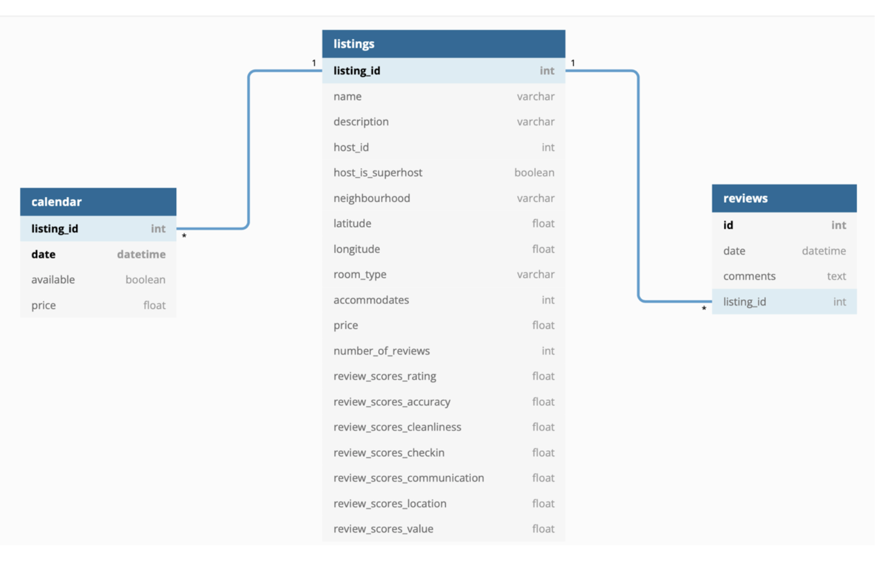
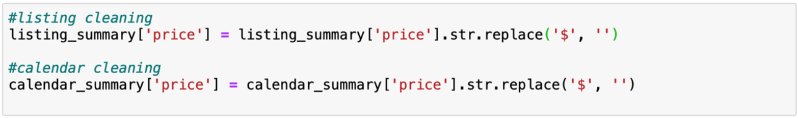
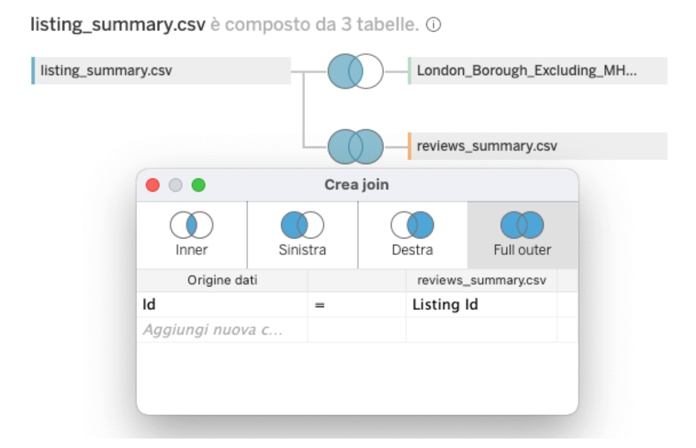
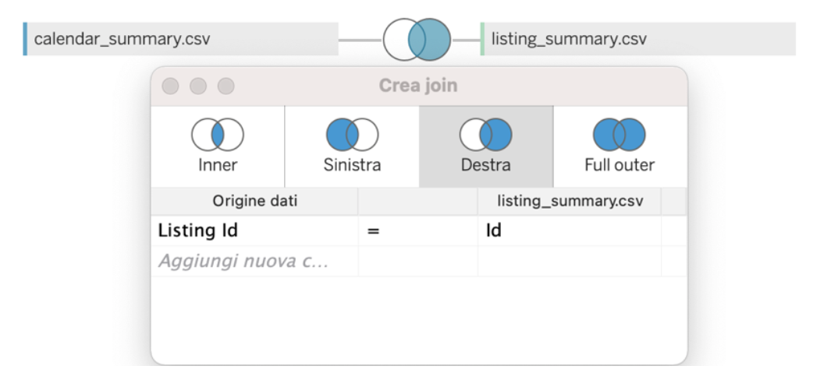

# London Airbnb: data visualization

## Introduction

The project we worked on is based on data relating to the AirBnb service, a portal that connects people looking for accommodation in a specific city for short periods of time, with other people who have accommodation to rent. We will specifically focus on the AirBnb service in the city of London, United Kingdom, a very visited place internationally, for vacation, work commitments and commitments due to study or university.
The following project aims to analyze this service, through visualizations, to identify the best neighborhoods to stay in the city of London taking into account various factors including: the time of year, the price, user ratings, the type of apartment and the number of guests, thus making it possible to understand many of the characteristics that make up the AirBnb service. Furthermore, the consequences of using the service caused by the restrictions given by the Covid-19 pandemic are analysed, highlighting the changes that have taken place.

## Dataset 
The data used concern all the listings on the Airbnb site from September 2021 to December 2021, and come from publicly available information on the site. Specifically, all the ads present, the reviews of these ads and the calendar relating to future availability until December 2022 were scraped.
The dataset can be downloaded from the link (*http://insideairbnb.com/get-the-data.html) via a collection of three Csv files, which respectively include the listings, the reviews and the calendar.
The tool used to produce the visualizations is Tableau.

## Main features selection
Each file in .csv format contained in the collection represents a relational database table, with the related primary keys, foreign keys and association relationships.
There are 74 different attributes in the original dataset, most of which are unnecessary and not significant for the purpose of this case study, and which would make processing the file computationally expensive. A selection process of the significant attributes was therefore carried out, creating three new files in .csv format which contained only the fields strictly necessary for the purpose of the various visualisations.

## Data Understanding
Below are the tables, in Figure 1, deriving from the files after having carried out the selection process, with a detailed description of all the selected fields. Each of these tables represents an entity within the relational type diagram.

## Data Preprocessing
The data obtained is presented in several files representing the different entities. Some of the different fields were not suitable for carrying out the various analyzes and visualizations, therefore a cleaning process was carried out for the two "price" fields present in the Listings and Calendar tables, eliminating the "$" character, which made it a string type field within Tableau software.

## Join operations
The Join operation was performed between the two tables Listings and Reviews in such a way as to obtain a single table on which it was possible to build the views. Through this operation, visible in figure 3, the listings_summary file was connected, which contains all the information on the ads, to the reviews_summary file, which includes all the reviews received for each ad present, via the "listing_id" external key.
Subsequently, a dataset was downloaded containing the various spatial data of the shapefile type relating to the districts of London, in such a way as to be able to obtain a complete visualization of a geographical map on which a clear division of the city by districts is visible. The table containing the shapefile spatial data has been joined to the current table through a further Join operation using the various neighborhood names as a foreign key.

The table obtained is composed of 35 fields and 1,061,563 rows.
Given the large number of records in the table, in order to be able to view the "calendar_summary" table, it was decided to carry out a further join operation (figure 4) between the "calendar_summary" and "listings_summary" files as making a single table for the three entities would have generated too large a file. This table obtained is composed of 29 fields and 24,322,727 rows.

# Charts
## 1. Does a higher average price ensure a high score on location reviews?

The visualization chosen is a spatial graph (figure 5) which represents two geographical maps of the city, respectively a map which indicates the variation of the average price within each district and one which represents the average evaluation given by users in each district regarding the accommodation location. This representation has the objective of immediately comparing the relationship between the average price and the score on the location of the accommodation, so as to identify which neighborhoods have the best quality/price ratio. The location score is a rating that indicates the safety, features of points of interest, stations, and transportation points. To indicate the variation of the average ratings, a colormap was chosen that allowed the worst ratings to be indicated in red, the average ones in yellow and the best ones in green.

